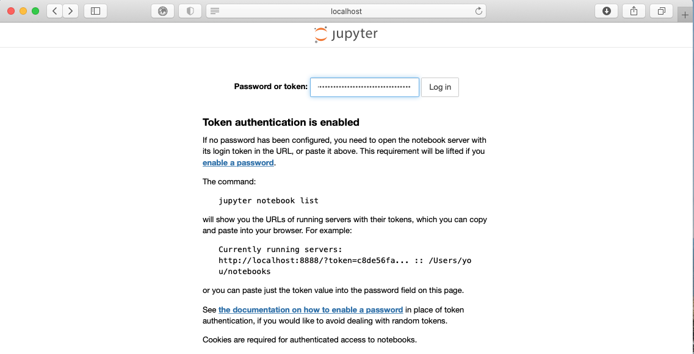
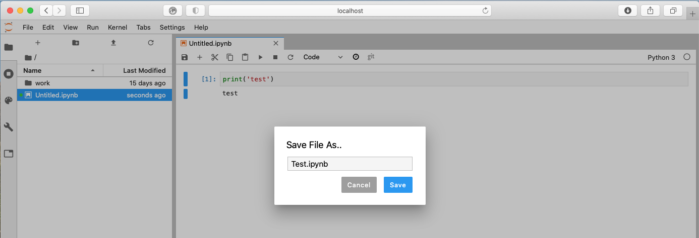
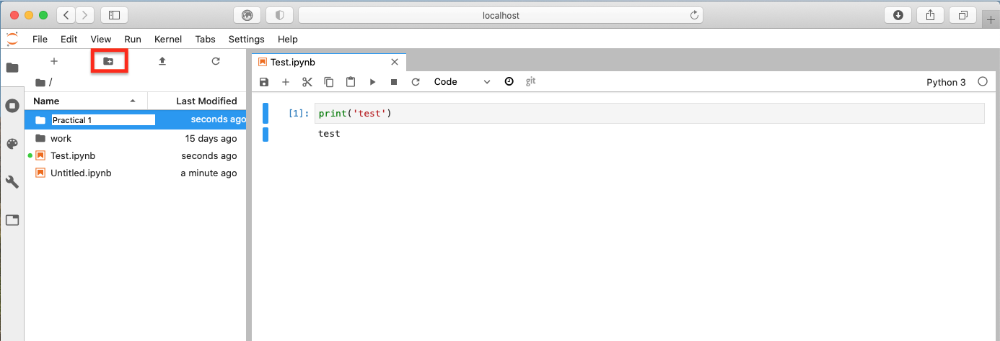
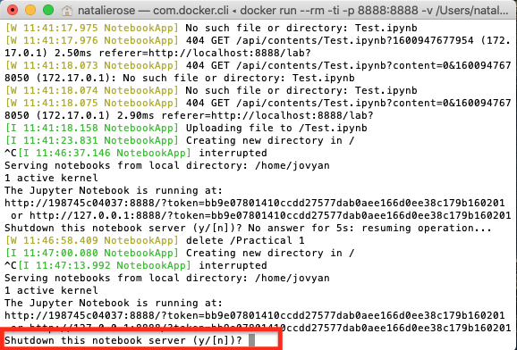

# MacOS Installation {#mac}

>Instructions to install, test and run `gds_env` with the Docker for Mac Desktop app.
### Requirements
### Install steps
### Check success
## Running Python through Docker

## Downloading Docker for MacOS

### Requirements
1. A stable internet connection
2. ~1.4GB of space on your hard drive
2. MacOS version 10.13 or newer i.e. High Sierra, Mojave or Catalina
3. Mac hardware must be a 2010 model or newer

### Installation steps
1. Go to the [dockerhub website](https://hub.docker.com/editions/community/docker-ce-desktop-mac/).
2. Ensure you meet the criteria for download (it is the same as stated above) and then select 'Get Stable' button.

```{r fig1, fig.align = 'center', echo = FALSE}
knitr::include_graphics("figs/chp1/Figure1.png")
```
<br>

3. This will then download to your machine but may take some time. Once finished, to access this download go to **Finder** > **Downloads** > **Docker.dmg** and double click.

```{r fig2, fig.align = 'center', echo = FALSE}
knitr::include_graphics("figs/chp1/Figure2.png")
```

<br>

4. You should then be prompted to drag and drop this application into the applications folder like so:

```{r fig3, fig.align = 'center', echo = FALSE}
knitr::include_graphics("figs/chp1/Figure3.png")
```
You may get further windows asking for access to the program. To these you can click **Open** > **Ok** > enter your account password and click **Install helper**

<br>


5. After you have done this, the whale icon should now show in your taskbar:
```{r fig4, fig.align = 'center', echo = FALSE}
knitr::include_graphics("figs/chp1/Figure4.png")
```

<br>

You have successfully downloaded Docker!

Next steps: [Using Docker]

## Using Docker
Now we have Docker installed we can use it to access Python and all the associated packages we need for the practicals

### Installing the GDS environment
1. Access your terminal: **Launchpad** > **Other** > **Terminal**
2. In a fresh line in the terminal type the following to install the GDS environment container: docker pull darribas/gds:3.0
```{r fig5, fig.align = 'center', echo = FALSE}
knitr::include_graphics("figs/chp1/Figure5.png")
```

<br>

3. This should now prompt a long download process that looks a bit like this:
```{r fig6, fig.align = 'center', echo = FALSE}
knitr::include_graphics("figs/chp1/Figure6.png")
# need to make these 2 images bigger and clearer
```
Dont be alarmed if it seems to take a very long time.

You will know this has completed when each line says 'Pull complete' and the new line gives your machine name followed by a $ sign.

### Running the container

1. In the new terminal line type the following command to run the container: docker run --rm -ti -p 8888:8888 -v ${PWD}:/home/jovyan/work darribas/gds:3.0

```{r fig7, fig.align = 'center', echo = FALSE}
knitr::include_graphics("figs/chp1/Figure7.png")
# need to make this image bigger and clearer
```

<br>

You have now started a Python session. 

**NOTE: It is important that you do not close the terminal window until you are finished in this Python session**

2. To access this session go to your chosen web browser (e.g. Safari/Chrome) and type: localhost:8888 into the search bar

3. The page that loads will prompt you for a password. This password can be found in the text in the terminal following the last command you ran (step 9). A long series of numbers and letters will be preceded by '?token='. Copy this long series of characters and paste into the password box in your browser.

```{r fig9, fig.align = 'center', echo = FALSE}
knitr::include_graphics("figs/chp1/Figure9.png")
# all terminal pics need to be bigger and clearer

```

<br>

```{r fig10, fig.align = 'center', echo = FALSE}

```

4. Now you are in Jupyter Lab you can open up a Python 3 notebook

```{r fig11, fig.align = 'center', echo = FALSE}
knitr::include_graphics("figs/chp1/Figure11.png")
```

<br>

[Using Jupyter Notebook]


## Using Jupyter Notebook

- This notebook is where you will run your code. Each shaded box is called a kernel. To test this out you can type 'print('test')' into one of these kernels. To run the code use the shortcut Ctrl + Enter.

```{r fig12, fig.align = 'center', echo = FALSE}
knitr::include_graphics("figs/chp1/Figure12.png")
```

<br>


- You can save your notebook using **File** > **Save notebook as** 
```{r fig13, fig.align = 'center', echo = FALSE}

```

<br>

- You can create new folders to organise your work
```{r fig14, fig.align = 'center', echo = FALSE}

```

<br>

[Ending your session]

## Ending your session

Once you have finished in your Jupyter session and have saved all your work, you can end the session from the terminal.

Using Ctrl+C will prompt a y/n option. Either type y or Ctrl + C again to end the session. 

```{r fig15, fig.align = 'center', echo = FALSE}

```

<br>

You can now safely shut the terminal window.

<br>

Next time you go to run a Jupyter Notebook you will not need to repeat the whole process as you have already installed Docker and the GDS environment. Instead you can start from Section 2.2: [Running the container] and carry on from there.


