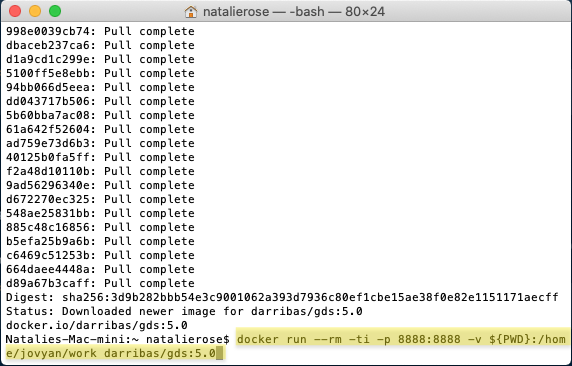
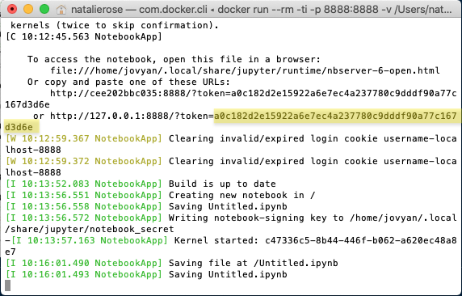

# MacOS Installation {#macos .unnumbered}

**NOTE** This guide shows you how to install on MacOS via the `gds_env` [@gds_env]

## Installation {.unnumbered}

### Requirements {.unlisted .unnumbered}

To be able to complete this guide, your machine will need to meet the following requirements:

1. A stable internet connection
2. ~10GB of space on your hard drive
3. MacOS version 10.13 or newer i.e. High Sierra, Mojave or Catalina. If you are unsure what version you are running click on the Apple icon in the top left of the screen and then **About this Mac**.
4. Mac hardware must be a 2010 model or newer

### Docker install steps {.unlisted .unnumbered}

1. Go to the [dockerhub website](https://hub.docker.com/editions/community/docker-ce-desktop-mac/).
2. Ensure you meet the criteria for download (it is the same as stated above) and then select 'Get Stable' button.

```{r fig1, fig.align = 'center', echo = FALSE}
knitr::include_graphics("figs/chp1/Figure1.png")
```
<br>

3. This will then download to your machine but may take some time. Once finished, to access this download go to **Finder** > **Downloads** > **Docker.dmg** and double click.

```{r fig2, fig.align = 'center', echo = FALSE}
knitr::include_graphics("figs/chp1/Figure2.png")
```

<br>

4. You should then be prompted to drag and drop this application into the applications folder like so:

```{r fig3, fig.align = 'center', echo = FALSE}
knitr::include_graphics("figs/chp1/Figure3.png")
```
You may get further windows asking for access to the program. To these you can click **Open** > **Ok** > enter your account password and click **Install helper**

<br>


5. After you have done this, the whale icon should now show in your taskbar:
```{r fig4, fig.align = 'center', echo = FALSE}
knitr::include_graphics("figs/chp1/Figure4.png")
```

<br>

You have successfully downloaded Docker!

### Using Docker {.unlisted .unnumbered}

Now we have Docker installed we can use it to access Python and all the associated packages we need for the practicals

### Installing the GDS environment {.unlisted .unnumbered}

1. Access your terminal: **Launchpad** > **Other** > **Terminal**
2. In a fresh line in the terminal type the following to install the GDS environment container: 

**NOTE**: please ignore the version showing in the screenshot, follow that in
the command below

```shell
docker pull darribas/gds:6.0
```

```{r fig5, fig.align = 'center', echo = FALSE}
knitr::include_graphics("figs/chp1/Figure5.png")
```

<br>

3. This should now prompt a long download process that looks a bit like this:
```{r fig6, fig.align = 'center', echo = FALSE}
knitr::include_graphics("figs/chp1/Figure6.png")
```
Dont be alarmed if it seems to take a very long time.

<div class="alert alert-info" style="font-size:120%">
<b>IMPORTANT</b>: <br>
    
Make sure you are connected to the internet and it is a stable connection. This step involves the download of large amounts of data (ca. 10GB) so it might take a while. However, it only needs to be run once.
   
</div>

### Check success {.unlisted .unnumbered}

You will know the process has completed successfully when each line says 'Pull complete' and the new line shows your machine name.

If everything has gone according to plan, you should see `darribas/gds:6.0` show up on your terminal when you type `docker image ls` (note in the image below there are other containers that are not required, do not worry if you don't have those or slightly different values on the ID and the "CREATED" columns, the important bit is having `darribas/gds:6.0` listed):

**NOTE**: please ignore the version showing in the screenshot, follow that in
the command below

```{r fig6ii, fig.align = 'center', echo = FALSE}
knitr::include_graphics("figs/chp1/Figure8.png")
```
<br>

## Running Python {.unnumbered}

The following sections cover how to spin up a session you have just installed, use it, and shut it down when you are done.

### Running the container {.unlisted .unnumbered}

1. In the new terminal line type the following command to run the container: `docker run --rm -ti -p 8888:8888 -v ${PWD}:/home/jovyan/work darribas/gds:6.0`

**NOTE**: please ignore the version showing in the screenshot, follow that in
the command below

```{r fig7, fig.align = 'center', echo = FALSE}

```

<br>

You have now started a Python session. 

<div class="alert alert-info" style="font-size:120%">
<b>IMPORTANT</b>: <br>
    
Please do NOT close the terminal window until you are finished in this Python session
   
</div>

2. To access this session go to your chosen web browser (e.g. Safari/Chrome) and type: `localhost:8888` into the search bar

```{r fig10, fig.align = 'center', echo = FALSE}

```

3. The page that loads will prompt you for a password or a token. This can be found in the text in the terminal following the last command you ran (step 9). A long series of numbers and letters will be preceded by `?token=`. Copy this long series of characters and paste into the password box in your browser.

```{r fig9, fig.align = 'center', echo = FALSE}

```

<br>

4. Now you are in Jupyter Lab you can open up a Python 3 notebook

```{r fig11, fig.align = 'center', echo = FALSE}
knitr::include_graphics("figs/chp1/Figure11.png")
```

<br>

### Using Jupyter Notebook {.unlisted .unnumbered}

- This notebook is where you will run your code. Each shaded box is called a kernel. To test this out you can type `print('test')` into one of these kernels. To run the code use the shortcut `Ctrl + Enter`.

```{r fig12, fig.align = 'center', echo = FALSE}

```

<br>

<div class="alert alert-info" style="font-size:120%">
<b>IMPORTANT</b>: <br>
    
Make sure you save files you want to keep **ONLY** _within_ the `work` folder, as this will ensure they are saved on your machine.
    
Everything saved outside the `work` folder will be _destroyed_ as soon as you shut down the session.
   
</div>


- You can access other files on your machine through the `work` folder in the File Browser. From here you can navigate to your Documents and designated folder for this module. 

```{r fig15a, fig.align = 'center', echo = FALSE}

```

```{r fig15b, fig.align = 'center', echo = FALSE}

```

```{r fig15c, fig.align = 'center', echo = FALSE}
knitr::include_graphics("figs/chp1/Figure15c.png")
```


Here I am navigating to the GDS folder that I have created for this module in my Documents. You can replace this with the pathway to the folder you create for this module.

<br>

- You can save your notebook here using **File** > **Save notebook as**
```{r fig13, fig.align = 'center', echo = FALSE}

```

<br>

- And you can create new folders to organise your work
```{r fig14, fig.align = 'center', echo = FALSE}
knitr::include_graphics("figs/chp1/Figure14_new.png")
```

<br>

### Ending your session {.unlisted .unnumbered}
Once you have finished in your Jupyter session and have saved all your work, you can end the session from the terminal.

Using `Ctrl + C` will prompt a `y/n` option. Either type `y` or `Ctrl + C` again to end the session. 

```{r fig16, fig.align = 'center', echo = FALSE}
knitr::include_graphics("figs/chp1/Figure16.png")
```

<br>

You can now safely shut the terminal window.

<br>

Next time you go to run a Jupyter Notebook you will not need to repeat the whole process as you have already installed Docker and the GDS environment. Instead you can start from [Running the container] and carry on from there.
