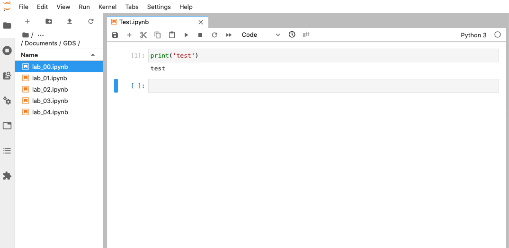

# Linux Installation {#linux .unnumbered}

**NOTE** This guide shows you how to install on Linux via the `gds_env` [@gds_env]

## Installation {#linux_install .unnumbered}

### Requirements {.unlisted .unnumbered}

To be able to complete this guide, your machine will need to meet the following requirements:

1. A stable internet connection
2. ~10GB of space on your hard drive
3. A Linux distribution supported by Docker. You can check available distributions for ready installation on [this page](https://hub.docker.com/search?q=&type=edition&offering=community&operating_system=linux).

**NOTE** If you are running a different distribution (e.g. Arch Linux), there is a good chance Docker _will_ work, but you will have to source your own instructions for installation. Once you have Docker up and running on your machine, you can move to [Installing the GDS container].

### Docker install steps {.unlisted .unnumbered}

1. Select the page for your distribution from the [Docker Hub list of supported distributions](https://hub.docker.com/search?q=&type=edition&offering=community&operating_system=linux)

```{r ch1fig1, fig.align = 'center', echo = FALSE}
knitr::include_graphics("figs/chp2/docker_distros.png")
```
<br>

For this example, we will use Ubuntu.

2. Make sure that you meet the requirements to install Docker:

```{r ch1fig2, fig.align = 'center', echo = FALSE}
knitr::include_graphics("figs/chp2/ubuntu.png")
```
<br>

3. Follow the steps specified on the official install guide:

> [https://docs.docker.com/engine/install/ubuntu/](https://docs.docker.com/engine/install/ubuntu/)

Once you complete these steps successfully, you will have Docker ready to go on your computer, congratulations!

### Installing the GDS container {.unlisted .unnumbered}

Once you have Docker installed and running on your machine, installing everything you need to run Python and associated libraries boils down to the following two steps:

1. Open your terminal app of choice (for example, Gnome Terminal)
2. Run the following command:

```shell
docker pull darribas/gds:5.0
```

```{r ch1fig3, fig.align = 'center', echo = FALSE}
knitr::include_graphics("figs/chp2/terminal_pull.png")
```
<br>

You will know this has completed when each line says 'Pull complete'.

<div class="alert alert-info" style="font-size:120%">
<b>IMPORTANT</b>: <br>
    
Make sure you are connected to the internet and it is a stable connection. This step involves the download of large amounts of data (ca. 10GB) so it might take a while. However, it only needs to be run once.
   
</div>

### Check success {.unlisted .unnumbered}

If everything has gone according to plan, you should see `darribas/gds:5.0` show up on your terminal when you type `docker image ls` (note in the image below there are other containers that are not required, do not worry if you don't have those or slightly different values on the ID and the "CREATED" columns, the important bit is having `darribas/gds:5.0` listed):

```{r ch1fig4, fig.align = 'center', echo = FALSE}
knitr::include_graphics("figs/chp2/docker_image_ls.png")
```
<br>

## Running Python {#linux_run .unnumbered}

The following sections cover how to spin up the container you have just installed, use it, and shut it down when you are done.

### Running the container {.unlisted .unnumbered}

To start up Python through Docker, follow these steps:

1. In a new terminal line, type the following command to run the container and hit enter: 

```shell
docker run --rm -ti -p 8888:8888 -v ${PWD}:/home/jovyan/work darribas/gds:5.0
```

```{r ch1fig5, fig.align = 'center', echo = FALSE}

```

<br>

You have now started a Python session. 


<div class="alert alert-info" style="font-size:120%">
<b>IMPORTANT</b>: <br>
    
Please do NOT close the terminal window until you are finished in this Python session
   
</div>

2. To access this session go to your chosen web browser (e.g. Firefox/Chrome) and type: `localhost:8888` into the search bar

<br>

```{r ch1fig7, fig.align = 'center', echo = FALSE}
knitr::include_graphics("figs/chp1/Figure10.png")
```

3. The page that loads will prompt you for a password or a token. This can be found in the text in the terminal following the last command you ran (step 9). A long series of numbers and letters will be preceded by `?token=`. Copy this long series of characters and paste into the password box in your browser.

```{r ch1fig6, fig.align = 'center', echo = FALSE}
knitr::include_graphics("figs/chp2/docker_token.png")
```


4. Now you are in Jupyter Lab you can open up a Python 3 notebook

```{r ch1fig8, fig.align = 'center', echo = FALSE}
knitr::include_graphics("figs/chp1/Figure11.png")
```

<br>

### Using Jupyter Notebook {.unlisted .unnumbered}

- This notebook is where you will run your code. Each shaded box is called a kernel. To test this out you can type `print('test')` into one of these kernels. To run the code use the shortcut `Ctrl + Enter`.

```{r ch1fig9, fig.align = 'center', echo = FALSE}
knitr::include_graphics("figs/chp1/Figure12.png")
```

<br>

<div class="alert alert-info" style="font-size:120%">
<b>IMPORTANT</b>: <br>
    
Make sure you save files you want to keep **ONLY** _within_ the `work` folder, as this will ensure they are saved on your machine.
    
Everything saved outside the `work` folder will be _destroyed_ as soon as you shut down the session.
   
</div>

- You can save your notebook using **File** > **Save notebook as**
```{r ch1fig10, fig.align = 'center', echo = FALSE}
knitr::include_graphics("figs/chp1/Figure13.png")
```

<br>

- You can create new folders to organise your work
```{r ch1fig11, fig.align = 'center', echo = FALSE}
knitr::include_graphics("figs/chp1/Figure14.png")
```

<br>

- And you can access other files on your machine through the 'work' folder in the File Browser. From here you can navigate to your Documents and designated folder for this module

```{r ch1fig12, fig.align = 'center', echo = FALSE}
knitr::include_graphics("figs/chp1/Figure15a.png")
```

```{r ch1fig13, fig.align = 'center', echo = FALSE}
knitr::include_graphics("figs/chp1/Figure15b.png")
```

```{r ch1fig14, fig.align = 'center', echo = FALSE}

```
<br>

### Ending your session {.unlisted .unnumbered}

Once you have finished in your Jupyter session and have saved all your work, you can end the session from the terminal.

Using `Ctrl + C` will prompt a `y/n` option. Either type `y` or `Ctrl + C` again to end the session. 

```{r ch1fig15, fig.align = 'center', echo = FALSE}
knitr::include_graphics("figs/chp2/docker_end.png")
```

<br>

You can now safely shut the terminal window.

<br>

Next time you go to run a Jupyter Notebook you will not need to repeat the whole process as you have already installed Docker and the GDS environment. Instead you can start from [Running Python through Docker] and carry on from there.
