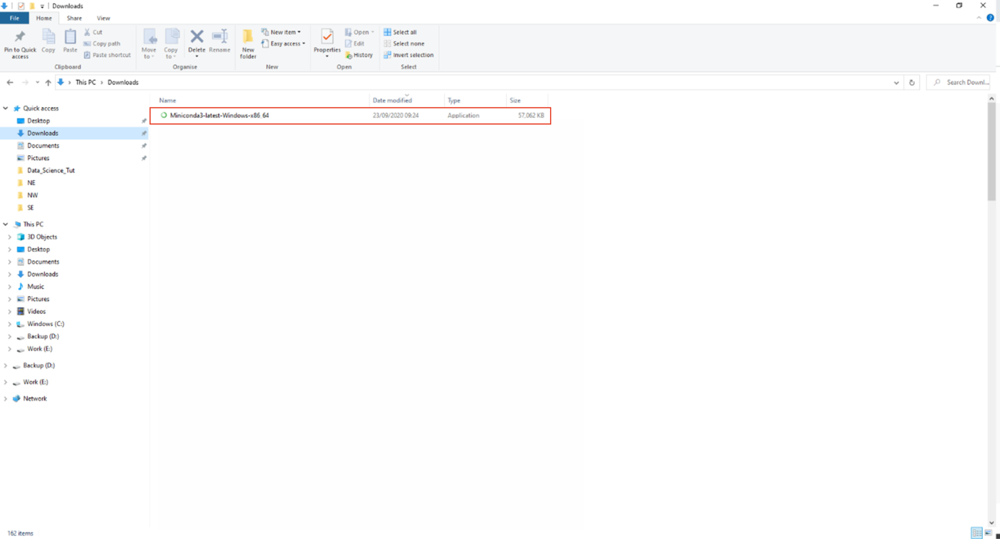
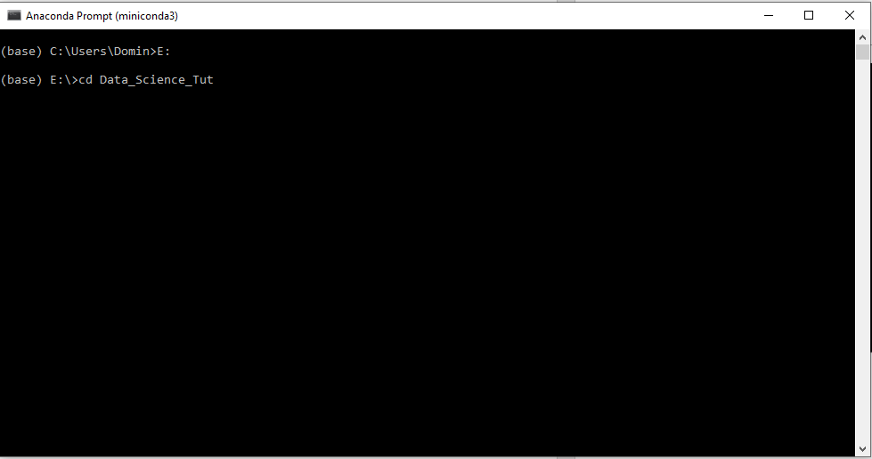
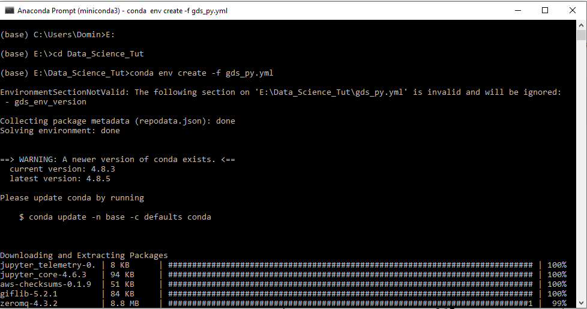
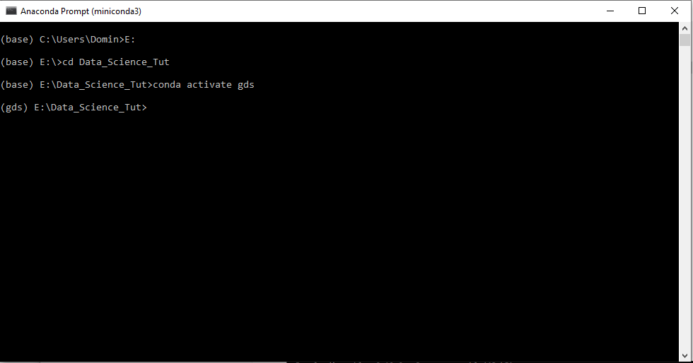
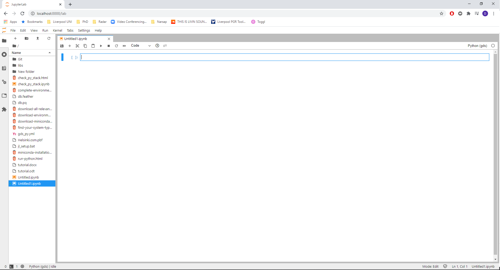

# Windows Home or pre-10 Installation {.unnumbered}

## Installing Python {.unnumbered}

### Environment File {.unlisted .unnumbered}

We will start by downloading an environment file, which will later on install all packages that are relevant for your coding

**NOTE: It would be best to create a dedicated folder (e.g. GDS_2020) for this module.**

```{r fig4, fig.align = 'center', echo = FALSE}
knitr::include_graphics("figs/chp4/Picture4.png")
```

- To download the environment file, right click on this file 

[**gds_py.yml**](https://raw.githubusercontent.com/darribas/gds_env/master/gds_py/gds_py.yml) 

- Select **_Save link as_**.

```{r fig5, fig.align = 'center', echo = FALSE}
knitr::include_graphics("figs/chp4/Picture5.png")
```

-	A new window will pop up for saving the file, click on **_save_** to save the file. 
- Make sure to save the file to a location that you can easily find again. 


### User interface {.unlisted .unnumbered}

We will now download the file that will later setup your coding interface (which is called Jupyter Lab). 

-	To download the jupyter lab setup file, right click on this file 

[**jl_setup.bat**](https://gdsl-ul.github.io/soft_install/jl_setup.bat) 

```{r fig6, fig.align = 'center', echo = FALSE}
knitr::include_graphics("figs/chp4/Picture6.png")
```

- Select **_Save link as_**

```{r fig6_1, fig.align = 'center', echo = FALSE}
knitr::include_graphics("figs/chp4/Picture6_1.png")
```

-	A new window will pop up for saving the file, click on **_save_** to save the file. 
- Make sure to save the file to a location (the same location as the `gds_py.yml` file) that you can easily find again. 

### Download Miniconda {.unlisted .unnumbered}

> Find your system type

Before you can download Miniconda (which is a version of Anaconda), you need to find out what type your Windows system is.
It can either be 32 bit or 64 bit (most modern computers use 64 bit). 

```{r fig7, fig.align = 'center', echo = FALSE}
knitr::include_graphics("figs/chp4/Picture7.png")
```

-	Right click on the windows logo in the left bottom corner of the task menu and select **System**

```{r fig8, fig.align = 'center', echo = FALSE}
knitr::include_graphics("figs/chp4/Picture8.png")
```

-	This will bring you to your system information page.
- Look at the **System type** section and check if your operating system is 64-bit or 32-bit (highlighted in red). 

### Donwload Miniconda {.unlisted .unnumbered}


-	Continue with opening this link to [**Miniconda**](https://docs.conda.io/en/latest/miniconda.html#windows-installers) by right clicking on the link and then selecting **_Open in new tab_**.

```{r fig10, fig.align = 'center', echo = FALSE}
knitr::include_graphics("figs/chp4/Picture10.png")
```

-	This will bring you to the [Miniconda download](https://docs.conda.io/en/latest/miniconda.html#windows-installers) page shown above. 
-	You have installation files for two different Python version (2.7 and 3.8) and for two different Windows systems (32 bit and 64 bit).
-	We are using **Python 3.8**, so depending on which windows version you are using (32-bit or 64-bit), click on the relevant file in the Python 3.8 section (highlighted in red). 
-	This will download the Miniconda installation file to your **Downloads folder**. 

```{r fig11, fig.align = 'center', echo = FALSE}

```

-	Once the download has finished,navigate to your **Downloads folder** on your computer and double click on the _Miniconda3-latest-Windows-x86_64_ file to start the installation. 
-	Note: Double-check that you are installing the right version for your system. 

### Installing Minicoda {.unlisted .unnumbered}

```{r inst1, fig.align = 'center', echo = FALSE}
knitr::include_graphics("figs/chp4/inst_1.PNG")
```

-	Double clicking the downloaded file will open an installation window. 
- Click **_Next_** on the first step. 

```{r Inst2, fig.align = 'center', echo = FALSE}
knitr::include_graphics("figs/chp4/inst_2.PNG")
```

-	Click **_I Agree_** in the next step which is the Terms and Conditions.

```{r Inst_3, fig.align = 'center', echo = FALSE}
knitr::include_graphics("figs/chp4/inst_3.PNG")
```

- In the next window, you can select if you want to install Miniconda for all users or just you.
- Check that **_Just Me_** is selected and click next. 

```{r Inst4, fig.align = 'center', echo = FALSE}
knitr::include_graphics("figs/chp4/inst_4.PNG")
```

-	The next window will ask you where to install Miniconda.
- Leave the path (highlighted in blue) as is and click next. 

```{r Inst_5, fig.align = 'center', echo = FALSE}
knitr::include_graphics("figs/chp4/inst_5.PNG")
```
-	The next window can be used for an advanced setup
- Leave the default settings as they are (Box ticked at _Register Miniconda3 as my default Python 3.8_). 

```{r Inst6, fig.align = 'center', echo = FALSE}
knitr::include_graphics("figs/chp4/inst_6.PNG")
```

-	Miniconda is now installing. 
- Once the installation is complete, click **_Next_**.

```{r Inst7, fig.align = 'center', echo = FALSE}
knitr::include_graphics("figs/chp4/inst_7.PNG")
```

•	Untick all boxes in the window (unless you want further information on Miniconda, which will open in your browser) and click **_Finish_**. 


### Running Minicoda {.unlisted .unnumbered}

```{r fig20, fig.align = 'center', echo = FALSE}
knitr::include_graphics("figs/chp4/Picture20.png")
```

- Open Miniconda by clicking on the Windows icon on the bottom left of your screen and either type **_Anaconda_** or look for the **Anaconda folder** in the menu.

```{r fig21, fig.align = 'center', echo = FALSE}
knitr::include_graphics("figs/chp4/Picture21.png")
```

- To open Miniconda, click on **_Anaconda Prompt (miniconda3)_**.
**Note:** From now on we will refer to the prompt as **Anaconda Prompt**

```{r Conda1, fig.align = 'center', echo = FALSE}
knitr::include_graphics("figs/chp4/Conda_1.PNG")
```

- This will open the Anaconda command prompt.


```{r Conda2, fig.align = 'center', echo = FALSE}

```
```{r Conda3, fig.align = 'center', echo = FALSE}

```

- You now need to navigate to the folder that contains your environment (`_gds_py.yml_`) and setup (`_jl_setup.bat_`) files.

- you can move to the folder by running  `cd` to move forward through folders and `cd ..` to move backwards.

- To run a command you simply press enter. 

- If your files are stored in e.g. C:/Users/Domin/Desktop/GDS_2020 you would write `cd Desktop/GDS_2020`
  
- If your files are stored in a different location e.g. E:/Data_science_Tut, you would run `E:`
(to switch the harddrive) followed by `cd Data_science_Tut`.

```{r Conda4, fig.align = 'center', echo = FALSE}
knitr::include_graphics("figs/chp4/Conda_4.PNG")
```

- Once you have navigated to the location of your files, write the following in the Anaconda prompt and press enter to run it. 

`conda-env create -f gds_py.yml`

- This will install all packages that are required to complete the course and setup your Python environment.
** Note: This might take a while as it is downloading all packages (~ 500 MB).**

```{r Conda6, fig.align = 'center', echo = FALSE}

```

- The packages that are being installed will be shown in the Anaconda prompt. 

```{r Conda7, fig.align = 'center', echo = FALSE}
knitr::include_graphics("figs/chp4/Conda_7.PNG")
```

 - Once all packages have been installed and your environment is created, you can activate the environment with the following command:

`conda activate gds`

### Complete environment Setup

We will now complete the setup by installing the user interface (Jupyter Lab) which you will need to code. 

```{r Conda8, fig.align = 'center', echo = FALSE}

```

- Activate the environment by running :

`conda activate gds`

 - You can see that the start of the line has changed from **(base)** to **(gds)**.
 
```{r Conda9, fig.align = 'center', echo = FALSE}
knitr::include_graphics("figs/chp4/Conda_9.PNG")
```

- In the same prompt, run the following command to complete the environment setup

`jl_setup.bat`

- The prompt will show you the further packages that are being installed. 

**NOTE:** This might take a while depending on your internet connection (at least 10-15 minutes). 
**NOTE:** Do not close the Anaconda prompt yet as we will need it again. 


### Check Installation

To make sure that your installation was successful and all packages have been installed we need to run one more step. 

```{r Picture22, fig.align = 'center', echo = FALSE}
knitr::include_graphics("figs/chp4/Picture22.png")
```

- Download the following file [**check_py_stack**](https://raw.githubusercontent.com/darribas/gds_env/master/gds_py/check_py_stack.ipynb) by right clicking on it and selecting **_Save link as_**. 
- Save the file to the same location as all other files.

```{r Conda_11, fig.align = 'center', echo = FALSE}
knitr::include_graphics("figs/chp4/Conda_11.PNG")
```

- Go back to your Anaconda prompt (**make sure your environment is activated `conda activate gds` **) and enter the following command:

`jupyter nbconvert --to html --execute check_py_stack.ipynb`

- This will check if all packages are working properly and produce an output `.html` file called _check_py_stack.html_


```{r Picture23, fig.align = 'center', echo = FALSE}
knitr::include_graphics("figs/chp4/Picture23.png")
```

- Double clicking on the _check_py_stack.html_ file will open the file in a browser and you can check if the code has produce an output in all cells. 


## Running Python {.unnumbered}

Now that you have successfully installed Python/Anaconda, you are ready to start coding. 
To launch your coding environment complete the following steps:

1. Start by opening an Anaconda Prompt (see first steps of section 3.2 on how to open an Anaconda prompt).

2. Navigate to the folder that you want to work in (It is recommended to have all your files in one folder with subfolders) using the  `cd` command. 

3. Activate your environment by running `conda activate gds`.

```{r Conda13, fig.align = 'center', echo = FALSE}
knitr::include_graphics("figs/chp4/Conda_13.PNG")
```

4. Run the command `jupyer lab` to start your coding interface. The coding interface will launch in your default browser (We recommend using Chrome or Firefox).

  If your default browser is neither of the recommended, you can close the window that opens automatically, open Chrome/Firefox and past the URL from the Anaconda Prompt. 

```{r Pciture24, fig.align = 'center', echo = FALSE}

```
5. Jupyter Lab (your coding interface) will open automatically. 

<center>
**CONGRATULATIONS YOU HAVE NOW SUCCESFULLY INSTALLED PYTHON**

**You can now start coding**


<center>
