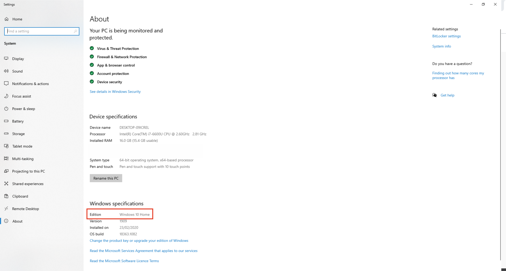

# Windows Version {.unnumbered}

Find your Windows version

```{r fig1, fig.align = 'center', echo = FALSE}
knitr::include_graphics("figs/chp5/Picture7.png")
```

- Right click on the Windows logo in the left bottom corner of your screen and click on _system_.

```{r fig2, fig.align = 'center', echo = FALSE}

```

- You can find your Windows version under _Windows Specifications_ and _Edition_ (Here it is Windows 10 Home).
