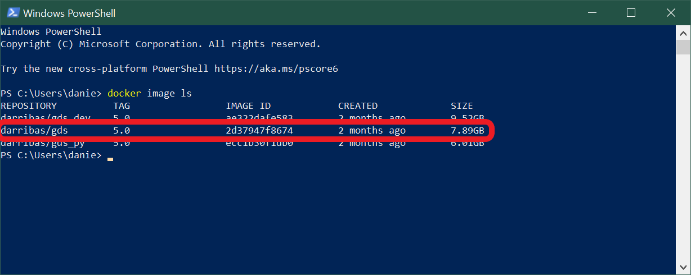

# Windows 10 Pro/Education {#win10pro .unnumbered}

**NOTE** This guide shows you how to install on Windows 10 Pro via the `gds_env` [@gds_env]

## Installation {#winpro_install .unnumbered}

### Requirements {.unlisted .unnumbered}

To be able to complete this guide, your machine will need to meet the following requirements:

1. A stable internet connection
2. ~10GB of space on your hard drive
3. Windows 10 64-bit: Pro, Enterprise, or Education (Build 16299 or later). You can see the full requirements on the official [Docker for Windows page](https://docs.docker.com/docker-for-windows/install/).

<div class="alert alert-danger" style="font-size:120%">
<b>IMPORTANT</b>: <br>
    
If you are not sure what version of Windows you are running, check out this [guide](#windows-version).
    
If you know you don't have Windows 10 Pro, for example you are running Windows 10 Home, please use [this install/run guide](#otherWin).
    
</div>
 
### Docker install steps {#winpro_docker_install .unlisted .unnumbered}

Once you have everything required ready to go, the first step is to install the Docker Desktop App for Windows. Here are the steps you can follow:

1. Head over to Docker Hub to download a copy of Docker for Windows:

> [https://hub.docker.com/editions/community/docker-ce-desktop-windows/](https://hub.docker.com/editions/community/docker-ce-desktop-windows/)


<br>

2. Download a copy of the Stable version (circled in red on the image above). Note this is about 400Mb so, depending on your connection, it might take a little bit.
3. Double click on the file you downloaded (a white cute whale on a blue background) and the "installation wizard" will appear. 
4. Follow the instructions on the installation wizard to authorize the installer and proceed with the install.

You can check the process has completed successfully by following these steps:

1. Open PowelShell from the "Start Menu"


<br>

2. Check Docker is available by printing out the version you have installed:

```shell
docker --version
```


<br>

Note that you might have installed a slightly different version and that is totally OK. What you want to make sure is that it successfully prints out a version instead of a warning/error message (usually in red).

### Installing the GDS container {#winpro_docker_gds .unlisted .unnumbered}

Once you have Docker installed and running on your machine, installing everything you need to run Python and associated libraries boils down to the following two steps:

1. Open PowerShell following the same steps as above (you can use the same window as before or a fresh new one).
2. Run (type and hit "Enter") the following command:

**NOTE**: please ignore the version showing in the screenshot, follow that in
the command below

```shell
docker pull darribas/gds:6.1
```


<br>

You will know this has completed when each line says 'Pull complete'.

<div class="alert alert-info" style="font-size:120%">
<b>IMPORTANT</b>: <br>
    
Make sure you are connected to the internet and it is a stable connection. This step involves the download of large amounts of data (ca. 10GB) so it might take a while. However, it only needs to be run once.
   
</div>

### Check success {#winpro_success .unlisted .unnumbered}

If everything has gone according to plan, you should see `darribas/gds:6.1` show up on your terminal when you type `docker image ls` (note in the image below there are other containers that are not required, do not worry if you don't have those or slightly different values on the ID and the "CREATED" columns, the important bit is having `darribas/gds:6.1` listed):

**NOTE**: please ignore the version showing in the screenshot, follow that in
the command below


<br>

## Running Python {#winpro_run .unnumbered}

The following sections cover how to start up the software you have just installed, use it, and shut it down when you are done.

### Running the container {.unlisted .unnumbered}

To start up Python through Docker, follow these steps:

1. In a new PowerShell window, type the following command to run the container and hit enter: 

**NOTE**: please ignore the version showing in the screenshot, follow that in
the command below


```shell
docker run --rm -ti -p 8888:8888 -v ${PWD}:/home/jovyan/work darribas/gds:6.1
```


<br>

You have now started a Python session. 


<div class="alert alert-info" style="font-size:120%">
<b>IMPORTANT</b>: <br>
    
Please do NOT close the PowerShell window until you are finished in this Python session
   
</div>

2. To access this session go to your chosen web browser (e.g. Firefox/Chrome) and type: `localhost:8888` into the search bar. You should see something similar to:

<br>


3. The page that loads will prompt you for a password or a token. This can be found in the text in the terminal following the last command you ran. This will be a long series of numbers and letters will be preceded by `?token=`. Copy this long series of characters and paste into the password box in your browser.


4. Now you are in Jupyter Lab, it should look like this, more or less:


<br>

### Using Jupyter Notebook {.unlisted .unnumbered}

- This notebook is where you will run your code. Each shaded box is called a kernel. To test this out you can type `print('test')` into one of these kernels. To run the code use the shortcut `Ctrl + Enter`.


<br>

<div class="alert alert-info" style="font-size:120%">
<b>IMPORTANT</b>: <br>
    
Make sure you save files you want to keep **ONLY** _within_ the `work` folder, as this will ensure they are saved on your machine.
    
Everything saved outside the `work` folder will be _destroyed_ as soon as you shut down the session.
   
</div>

- You can save your notebook using **File** > **Save notebook as**


<br>

- You can create new folders to organise your work


<br>

- And you can access other files on your machine through the 'work' folder in the File Browser. From here you can navigate to your Documents and designated folder for this module


<br>

### Ending your session {.unlisted .unnumbered}

Once you have finished in your Jupyter session and have saved all your work, you can end the session from the terminal.

Using `Ctrl + C` will prompt a `y/n` option. Either type `y` or `Ctrl + C` again to end the session. 


<br>

You can now safely shut the terminal window.

<br>

Next time you go to run a Jupyter Notebook you will not need to repeat the whole process as you have already installed Docker and the GDS environment. Instead you can start from [Running Python through Docker](#winpro_run) and carry on from there.
