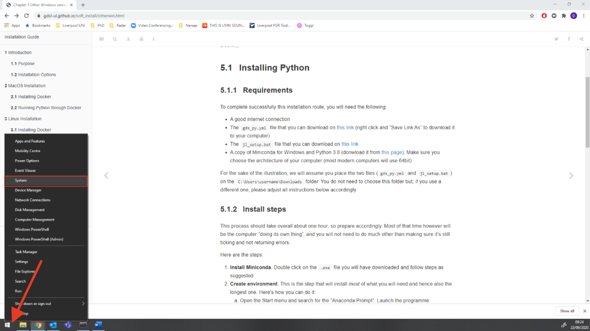

# Windows Specifications {#windows-version .unnumbered}

## Windows Version {.unnumbered .unlisted}

This guide shows you how to find out what version of Windows you are running.

Here are the steps you need to follow:

1. Right click on the Windows logo in the left bottom corner of your screen and click on _system_.

2. You will find the version of your Windows under _Windows Specifications_ and _Edition_ (here it is Windows 10 Home as an example):

Knowing the version you are running, you can then follow on to install Python for your version:

- If you are running Windows 10 Pro, head over [here](#win10pro)
- If you are running other versions, use [this guide](#otherWin)

## Windows Architechture {#windows-arch .unnumbered .unlisted}

<b>IMPORTANT</b>:  

This is only relevant if you do _not_ have Windows 10 Pro

 

If you are [installing Python natively](#otherWin), you will need to know whether your computer is 32bit or 64bit, that is its architecture. Most modern computers are 64bit, so there is a good chance that is your case. However, please make sure to avoid trouble down the installation process.

To check which architecture you have, follow these steps:

1. Right click on the Windows logo in the left bottom corner of the task menu and select **System**

This will bring you to your system information page

2. The architecture of your computer can be found under the **System type** section (highlighted in red, for this example it is 64-bit):

Knowing which architecture your computer has allows you to download the right version of Miniconda, one of the [requirements](#otherwin_reqs) for successful installation.
