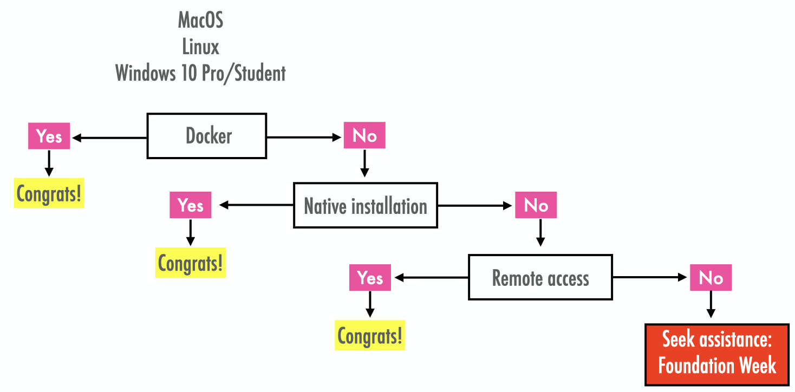
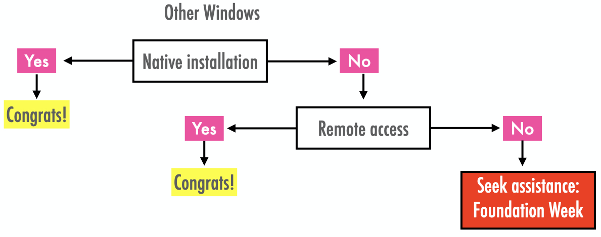

--- 
title: "Software Installation Guide"
author: "Francisco Rowe, Dani Arribas-Bel"
date: "`r Sys.Date()`"
site: bookdown::bookdown_site
output: bookdown::gitbook
documentclass: book
bibliography: [book.bib, packages.bib]
biblio-style: apalike
link-citations: yes
github-repo: GDSL-UL/soft_install
description: "Installation Guide for R and Python"
---

# Introduction

- Add some brief context on why this is important and needed in the context of COVID-19 and done in Foundation Week!

  > Restricted access to University computers

  > Consistency in installation

  > No concerns with software and focus on module content during the semester
  

## Purpose 

This guide provides step-by-step description on how to install and access Python from your own computer. Three alternatives are described: (1) local installation via *Docker*; (2) native local installation; and, (3) remote access.

## Installation Options

Installation options depend on your operating system. This guide supports **MacOS**, **Linux** and **Windows** operating systems.

### MacOS, Linux and Windows 10 Pro/Student users

Figure \@ref(fig:fig1) displays the installation options available for *MacOS*, *Linux* and *Windows 10 Pro/Student* users. The tree reflects our recommended installation. We strongly (1) local installation via *Docker* as the default option. If that is not possible, we recommend (2) native local installation as a second option. Failing this, we recommend (3) remote access to University computers. This last option requires good and stable internet connection. If any of these options work, you must attend one of the drop-in sessions in **Foundation Week**. 

```{r fig1, fig.cap='Decision Tree: Recommended installation for MacOS, Linux and Windows 10 Pro/Student users', fig.align = 'center', echo = FALSE}

```

For step-by-step instructions of the installation options listed in Figure \@ref(fig:fig1), dedicated guides have been created. *MacOS* users should refer to Chapter \@ref(mac). *Linux* users should refer to Chapter \@ref{#linux}. *Windows 10 Pro/Student* users should refer to Chapter \@ref{#win10pro}. 

### Other Windows users

For **other Windows users**, including other versions of Windows 10, option (1) local installation via *Docker* is NOT available. Figure \@ref(fig:fig2) shows the options available to these users. We strongly (1) a native local installation as the default option. If that is not possible, we recommend (2) remote access as a second option to University computers. Failing this, you must attend one of the drop-in sessions in **Foundation Week**. Step-by-step instructions for *other Windows users* are provided in Chapter {#otherwin}.

```{r fig2, fig.cap='Decision Tree: Recommended installation for other Windows users', fig.align = 'center', echo = FALSE}

```
    

---

Other parts that we might consider including:


