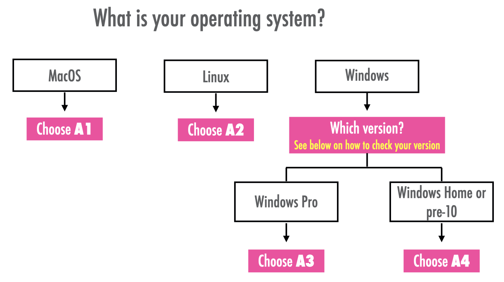

--- 
title: "Software Installation Guide"
author: "Francisco Rowe, Dani Arribas-Bel"
date: "`r Sys.Date()`"
site: bookdown::bookdown_site
output: bookdown::gitbook
documentclass: book
bibliography: [book.bib, packages.bib]
biblio-style: apalike
link-citations: yes
github-repo: GDSL-UL/soft_install
description: "Installation Guide for R and Python"
---

# Purpose {.unnumbered}

This guide provides step-by-step description on how to install and access Python from your own computer. 

Select your Operating System and follow the steps.

```{r fig1, fig.align = 'center', echo = FALSE}

```


<mark> **A1** [MacOS Installation](macos-installation.html) </mark>

<mark> **A2** [Linux Installation](linux-installation.html) </mark>

<mark> **A3** [Windows 10 Pro/Student Installation](windows-10-prostudent-installation) </mark>

<mark> **A4** [Windows Home or pre-10 Installation](windows-home-or-pre-10-installation.html) </mark>

*Need to find out your Windows version?* Click [HERE](windows-version)
